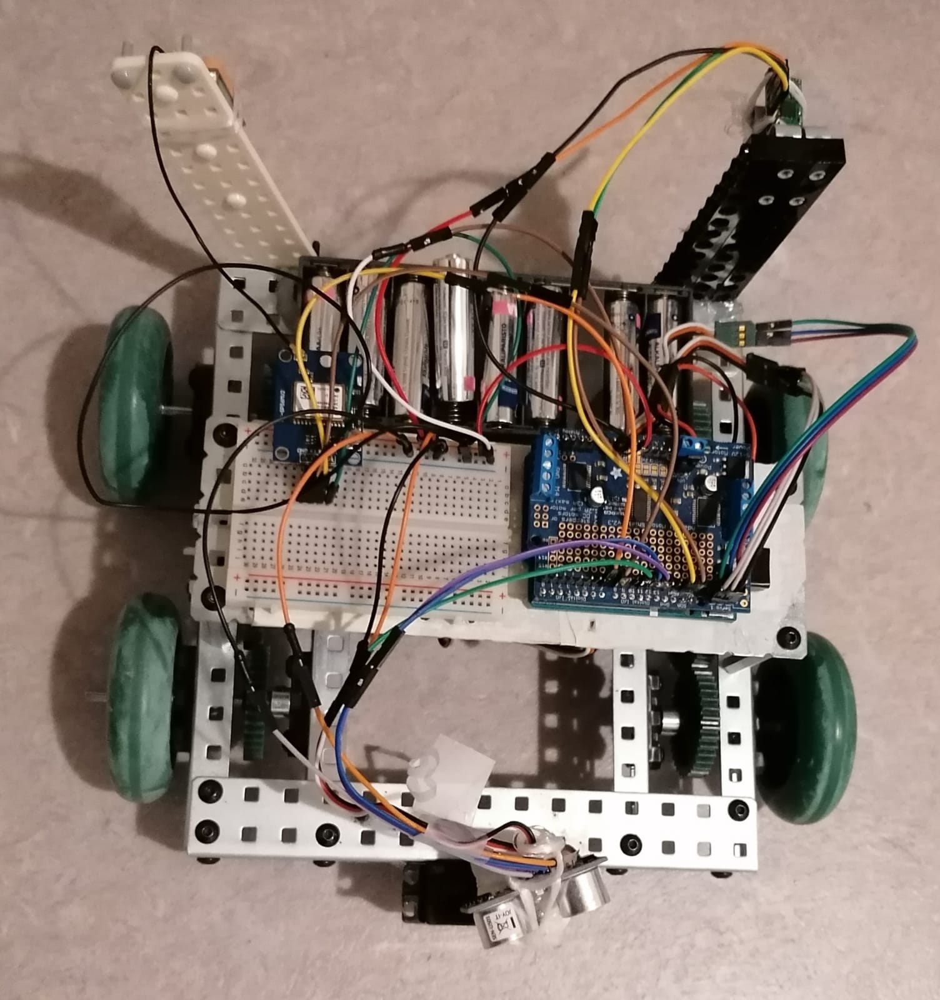

# GPS-Guided-Mobile-Robot
GPS-Guided Robot: This robot is designed to be autonomous by detecting its surroundings and navigating accordingly by using the GPS module attached to it. It is also equipped with ultrasonic sensors to detect obstacles. The most prominent technology to build the solution would be to use a real robot on a physical ground. Realistic technologies that can be used for this project are robots available in the lab of our university and GPS modules and other necessary sensors. Virtual simulation environments can also be used while developing the project. Possible robotics simulation Softwares are Webots, Gazebo Simulator, V-REP, NVIDIA ISAAC Platform for Robotics, Robot Virtual Worlds, and Microsoft Robotics Developer Studio. 

  
